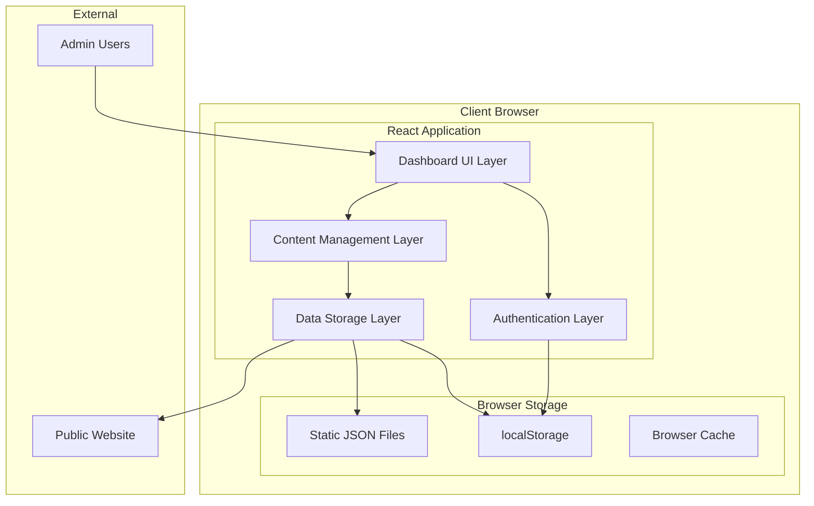
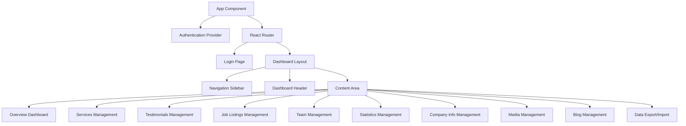

# Design Document: Dashboard CMS

## Overview

The Consulate Recruitment Dashboard and Content Management System is a React-based administrative interface that enables content management for the recruitment agency website. The system operates entirely client-side, using localStorage and JSON files for data persistence, with a responsive design built using Tailwind CSS and modern React patterns.

The architecture follows a modular approach with clear separation between authentication, content management, data storage, and user interface layers. The system integrates seamlessly with the existing Vite/React project structure while providing comprehensive content management capabilities.

## Architecture

### System Architecture



### Component Architecture

The system follows a hierarchical component structure:



## Components and Interfaces

### Authentication System

**AuthContext Interface:**
```typescript
interface AuthContextType {
  user: User | null;
  login: (credentials: LoginCredentials) => Promise<boolean>;
  logout: () => void;
  isAuthenticated: boolean;
  userRole: UserRole;
}

interface User {
  id: string;
  username: string;
  role: UserRole;
  permissions: Permission[];
}

type UserRole = 'admin' | 'editor' | 'viewer';
type Permission = 'read' | 'write' | 'delete' | 'export';
```

**Authentication Provider:**
- Manages user session state using React Context
- Stores authentication tokens in memory for security
- Provides role-based access control
- Handles session persistence across page refreshes using localStorage for user preferences only

### Content Management Interfaces

**Base Content Interface:**
```typescript
interface BaseContent {
  id: string;
  createdAt: Date;
  updatedAt: Date;
  createdBy: string;
  status: 'draft' | 'published' | 'archived';
}

interface Service extends BaseContent {
  title: string;
  description: string;
  category: 'recruitment' | 'cleaning' | 'consultation';
  features: string[];
  pricing?: string;
}

interface Testimonial extends BaseContent {
  clientName: string;
  clientRole: string;
  rating: number; // 1-5
  reviewText: string;
  clientImage?: string;
  companyName?: string;
}

interface JobListing extends BaseContent {
  title: string;
  description: string;
  location: string;
  employmentType: 'temporary' | 'permanent' | 'contract';
  requirements: string[];
  benefits: string[];
  salaryRange?: string;
}
```

### Data Storage Layer

**Storage Manager Interface:**
```typescript
interface StorageManager {
  // Generic CRUD operations
  create<T extends BaseContent>(collection: string, item: Omit<T, 'id' | 'createdAt' | 'updatedAt'>): Promise<T>;
  read<T extends BaseContent>(collection: string, id: string): Promise<T | null>;
  update<T extends BaseContent>(collection: string, id: string, updates: Partial<T>): Promise<T>;
  delete(collection: string, id: string): Promise<boolean>;
  list<T extends BaseContent>(collection: string, filters?: FilterOptions): Promise<T[]>;
  
  // Bulk operations
  export(): Promise<ExportPackage>;
  import(data: ExportPackage): Promise<ImportResult>;
  
  // Media operations
  uploadMedia(file: File): Promise<MediaAsset>;
  deleteMedia(id: string): Promise<boolean>;
}

interface FilterOptions {
  status?: string;
  category?: string;
  dateRange?: { start: Date; end: Date };
  searchTerm?: string;
}
```

### UI Component Library

**Reusable Components:**
- `DataTable`: Sortable, filterable table for content listings
- `ContentEditor`: Rich text editor with media integration
- `MediaUploader`: Drag-and-drop file upload with preview
- `FormBuilder`: Dynamic form generation for content types
- `ConfirmDialog`: Confirmation dialogs for destructive actions
- `LoadingSpinner`: Loading states and progress indicators
- `Toast`: Success/error notifications
- `Breadcrumbs`: Navigation breadcrumbs
- `SearchFilter`: Search and filter controls

## Data Models

### Content Collections

The system organizes content into distinct collections stored as JSON structures:

**Services Collection (`services.json`):**
```json
{
  "services": [
    {
      "id": "uuid",
      "title": "Temporary Staffing",
      "description": "Short-term staffing solutions...",
      "category": "recruitment",
      "features": ["Quick placement", "Flexible terms"],
      "createdAt": "2024-01-01T00:00:00Z",
      "updatedAt": "2024-01-01T00:00:00Z",
      "status": "published"
    }
  ]
}
```

**Media Assets Collection (`media.json`):**
```json
{
  "assets": [
    {
      "id": "uuid",
      "filename": "team-photo.jpg",
      "originalName": "team-photo.jpg",
      "mimeType": "image/jpeg",
      "size": 1024000,
      "url": "/uploads/team-photo.jpg",
      "thumbnail": "/uploads/thumbs/team-photo.jpg",
      "tags": ["team", "office"],
      "uploadedAt": "2024-01-01T00:00:00Z"
    }
  ]
}
```

### Configuration and Settings

**System Configuration (`config.json`):**
```json
{
  "site": {
    "title": "Consulate Recruitment Dashboard",
    "logo": "/assets/logo.png",
    "theme": "light"
  },
  "features": {
    "mediaUpload": true,
    "blogModule": true,
    "analytics": true
  },
  "limits": {
    "maxFileSize": 5242880,
    "maxFilesPerUpload": 10,
    "supportedFormats": ["jpg", "png", "webp", "svg", "pdf"]
  }
}
```

### User Management

**Users Collection (`users.json`):**
```json
{
  "users": [
    {
      "id": "uuid",
      "username": "admin",
      "passwordHash": "hashed_password",
      "role": "admin",
      "permissions": ["read", "write", "delete", "export"],
      "lastLogin": "2024-01-01T00:00:00Z",
      "isActive": true
    }
  ]
}
```

## Correctness Properties

*A property is a characteristic or behavior that should hold true across all valid executions of a system—essentially, a formal statement about what the system should do. Properties serve as the bridge between human-readable specifications and machine-verifiable correctness guarantees.*

Let me analyze the acceptance criteria to determine which ones can be tested as properties.

### Converting EARS to Properties

Based on the prework analysis, I'll convert the testable acceptance criteria into universally quantified properties, consolidating redundant properties for efficiency:

**Property 1: Authentication Access Control**
*For any* user credentials and role combination, the authentication system should grant or deny access based on the validity of credentials and apply appropriate role-based restrictions to available features
**Validates: Requirements 1.2, 1.3, 1.6**

**Property 2: Session State Management**
*For any* authenticated user session, logging out should clear all session data and redirect to login, while active sessions should maintain authentication state across operations
**Validates: Requirements 1.4, 1.5**

**Property 3: Content CRUD Operations**
*For any* content type (services, testimonials, jobs, team, blog), the CMS should provide complete CRUD operations that function consistently across all content collections
**Validates: Requirements 2.1, 3.1, 4.1, 5.1, 9.1**

**Property 4: Required Field Validation**
*For any* content creation or editing operation, the CMS should enforce required fields specific to each content type and prevent saving incomplete entries
**Validates: Requirements 2.2, 2.3, 3.2, 4.2, 5.2**

**Property 5: Data Persistence Consistency**
*For any* content save operation across all content types, the data store should immediately persist changes and update all related displays and references
**Validates: Requirements 2.6, 3.6, 4.6, 5.6, 6.6, 7.6, 8.6, 9.6**

**Property 6: Input Validation Rules**
*For any* user input (ratings, percentages, email addresses, phone numbers, file sizes), the CMS should validate values according to their specific constraints and reject invalid inputs
**Validates: Requirements 3.5, 5.5, 6.2, 6.3, 7.2, 7.5, 8.2**

**Property 7: Media Management Operations**
*For any* media file upload, the CMS should support specified formats, generate thumbnails, maintain metadata, and automatically update all content references when media is replaced
**Validates: Requirements 8.1, 8.2, 8.4, 8.5, 8.6**

**Property 8: Content State Management**
*For any* content item with status (jobs, blog posts), the CMS should support all defined states (active/inactive/archived, draft/published/scheduled) and enforce state transition rules
**Validates: Requirements 4.3, 9.2**

**Property 9: Export-Import Round Trip**
*For any* complete system state, exporting all data then importing it should preserve all content, relationships, and configuration settings without data loss
**Validates: Requirements 10.1, 10.4, 10.5, 10.6**

**Property 10: Role-Based Access Control**
*For any* user role and system feature, access should be restricted according to role permissions, with view-only users seeing analytics without editing capabilities
**Validates: Requirements 11.6**

**Property 11: Responsive Interface Behavior**
*For any* device type and screen size, the dashboard should provide appropriate touch support, loading feedback, and maintain consistent branding and navigation
**Validates: Requirements 12.1, 12.2, 12.3, 12.4, 12.5, 12.6**

## Error Handling

### Client-Side Error Management

**Authentication Errors:**
- Invalid credentials: Display clear error messages without revealing system details
- Session expiration: Automatically redirect to login with session timeout notification
- Permission denied: Show appropriate access denied messages based on user role

**Content Management Errors:**
- Validation failures: Highlight specific fields with descriptive error messages
- Save conflicts: Detect concurrent edits and provide conflict resolution options
- Data corruption: Implement data integrity checks with recovery suggestions

**Media Upload Errors:**
- File size exceeded: Show clear size limits and compression options
- Unsupported format: List supported formats and conversion suggestions
- Upload failures: Provide retry mechanisms with progress indicators

**Storage Errors:**
- localStorage quota exceeded: Implement cleanup strategies and user notifications
- Data retrieval failures: Provide fallback mechanisms and error recovery
- Import/export errors: Validate data integrity with detailed error reporting

### Error Recovery Strategies

**Automatic Recovery:**
- Retry failed operations with exponential backoff
- Cache user inputs during errors to prevent data loss
- Implement optimistic updates with rollback capabilities

**User-Guided Recovery:**
- Provide clear instructions for resolving common issues
- Offer data export before attempting risky operations
- Include system health checks and diagnostic tools

## Testing Strategy

### Dual Testing Approach

The testing strategy employs both unit tests and property-based tests to ensure comprehensive coverage:

**Unit Tests Focus:**
- Specific user interaction flows and edge cases
- Integration points between components
- Error conditions and boundary cases
- Authentication workflows and role transitions
- Media upload and processing scenarios

**Property-Based Tests Focus:**
- Universal properties that hold across all inputs
- CRUD operations consistency across content types
- Data validation rules across different input types
- State management behaviors across all user sessions
- Export/import round-trip integrity

### Property-Based Testing Configuration

**Testing Framework:** Fast-check (JavaScript property-based testing library)
- Minimum 100 iterations per property test
- Custom generators for content types, user roles, and media files
- Shrinking capabilities to find minimal failing examples

**Test Organization:**
Each property test references its design document property using the tag format:
**Feature: dashboard-cms, Property {number}: {property_text}**

**Example Property Test Structure:**
```javascript
// Feature: dashboard-cms, Property 3: Content CRUD Operations
fc.assert(fc.property(
  contentTypeGenerator(),
  contentDataGenerator(),
  (contentType, contentData) => {
    const cms = new ContentManagementSystem();
    
    // Test create operation
    const created = cms.create(contentType, contentData);
    expect(created).toBeDefined();
    
    // Test read operation
    const retrieved = cms.read(contentType, created.id);
    expect(retrieved).toEqual(created);
    
    // Test update operation
    const updated = cms.update(contentType, created.id, { title: 'Updated' });
    expect(updated.title).toBe('Updated');
    
    // Test delete operation
    const deleted = cms.delete(contentType, created.id);
    expect(deleted).toBe(true);
    expect(cms.read(contentType, created.id)).toBeNull();
  }
), { numRuns: 100 });
```

### Unit Testing Balance

Unit tests complement property tests by focusing on:
- Specific user workflows (login → navigate → edit → save)
- Error handling scenarios with specific inputs
- UI component behavior and user interactions
- Integration between authentication and content management
- Media processing with specific file types and sizes

Property tests handle comprehensive input coverage through randomization, while unit tests ensure specific critical paths work correctly.

### Test Data Management

**Test Fixtures:**
- Sample content data for each content type
- Mock user accounts with different roles
- Test media files of various formats and sizes
- Configuration presets for different scenarios

**Test Environment:**
- Isolated localStorage for each test suite
- Mock authentication providers for testing
- Simulated file upload scenarios
- Controlled timing for async operations