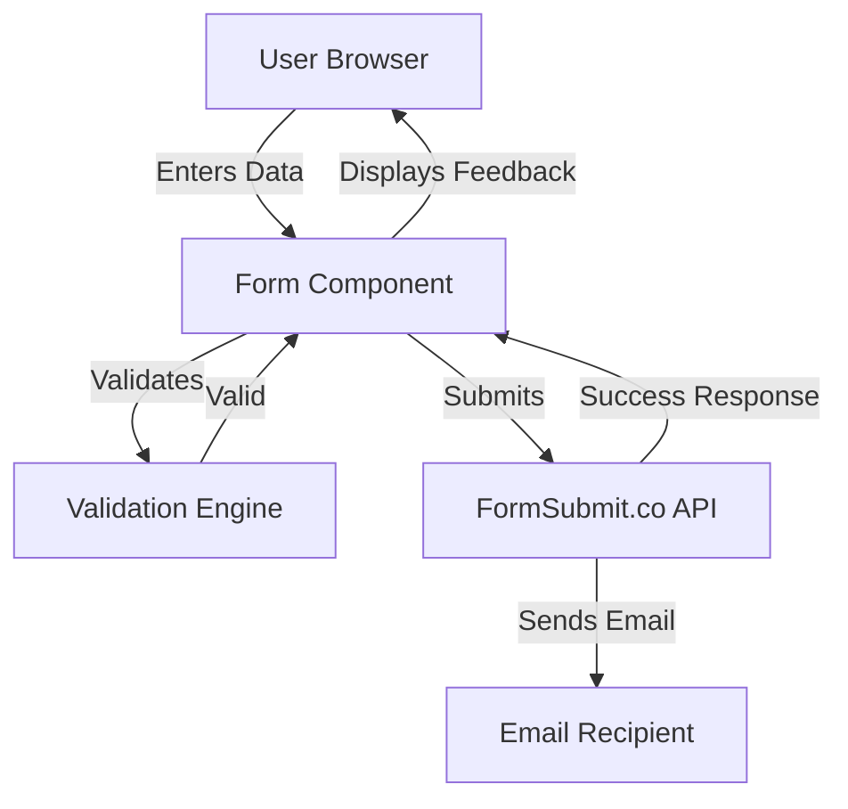
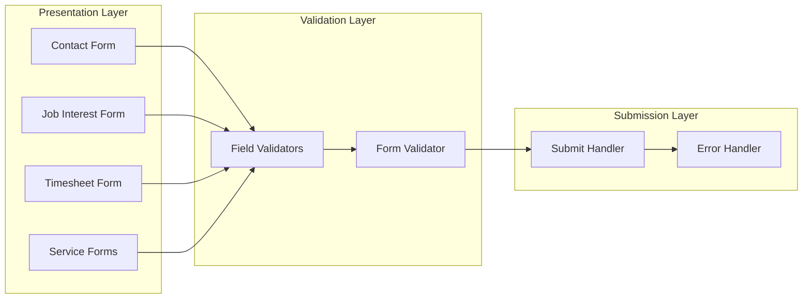

# Design Document: FormSubmit Email Integration

## Overview

The FormSubmit Email Integration feature provides a client-side form handling solution that processes user submissions across multiple pages of the Consulate Recruitment website. The design leverages FormSubmit.co as a third-party form backend, eliminating the need for custom server infrastructure while maintaining reliable email delivery to the administrative team.

The architecture follows a client-side validation and submission pattern where React components manage form state, validate inputs according to defined rules, and submit data to FormSubmit's API endpoint. The system supports seven distinct form types, each with custom email subjects and redirect destinations, while maintaining consistent validation logic and user feedback mechanisms.

Key design principles:
- **Zero backend infrastructure**: All form processing handled by FormSubmit.co
- **Client-side validation**: Immediate feedback before submission
- **Consistent user experience**: Unified validation and feedback across all forms
- **Accessibility-first**: WCAG 2.1 AA compliance for all form interactions
- **Mobile-responsive**: Touch-friendly interfaces for all device sizes

## Architecture

### High-Level Architecture



### Component Architecture

The system consists of three primary layers:

1. **Presentation Layer**: React form components that render UI and handle user interactions
2. **Validation Layer**: Pure functions that validate form field inputs against defined rules
3. **Submission Layer**: HTTP client logic that communicates with FormSubmit.co API



### Data Flow

1. **User Input**: User enters data into form fields
2. **Real-time Validation**: Each field validates on blur/change events
3. **Form-level Validation**: All fields validated before submission enabled
4. **Submission**: Valid form data sent to FormSubmit.co with hidden configuration fields
5. **Response Handling**: Success/error feedback displayed to user
6. **Email Delivery**: FormSubmit.co processes submission and sends email to admin

## Components and Interfaces

### Form Component Interface

Each form component implements a consistent interface:

```typescript
interface FormComponentProps {
  formType: FormType;
  emailSubject: string;
  redirectUrl: string;
  onSubmitSuccess?: () => void;
  onSubmitError?: (error: Error) => void;
}

interface FormState {
  fields: Record<string, string>;
  errors: Record<string, string>;
  isSubmitting: boolean;
  submitStatus: 'idle' | 'submitting' | 'success' | 'error';
  submitMessage: string;
}

interface FormActions {
  handleFieldChange: (fieldName: string, value: string) => void;
  handleFieldBlur: (fieldName: string) => void;
  handleSubmit: (event: FormEvent) => Promise<void>;
  resetForm: () => void;
}
```

### Validation Engine Interface

```typescript
interface ValidationRule {
  validate: (value: string) => boolean;
  errorMessage: string;
}

interface FieldValidationConfig {
  fieldName: string;
  rules: ValidationRule[];
  required: boolean;
}

interface ValidationResult {
  isValid: boolean;
  errors: Record<string, string>;
}

// Core validation functions
function validateField(value: string, config: FieldValidationConfig): string | null;
function validateForm(fields: Record<string, string>, configs: FieldValidationConfig[]): ValidationResult;
function validateEmail(email: string): boolean;
function validatePhone(phone: string): boolean;
function validateRequired(value: string): boolean;
function validateMinLength(value: string, minLength: number): boolean;
```

### Submission Handler Interface

```typescript
interface SubmissionConfig {
  endpoint: string; // FormSubmit.co URL
  captcha: boolean;
  subject: string;
  nextUrl: string;
}

interface SubmissionPayload {
  [fieldName: string]: string;
  _captcha: string;
  _subject: string;
  _next: string;
}

interface SubmissionResult {
  success: boolean;
  message: string;
  error?: Error;
}

async function submitForm(
  fields: Record<string, string>,
  config: SubmissionConfig
): Promise<SubmissionResult>;
```

### Form Type Configuration

```typescript
enum FormType {
  CONTACT = 'contact',
  JOB_INTEREST = 'job_interest',
  TIMESHEET = 'timesheet',
  PERMANENT_RECRUITMENT = 'permanent_recruitment',
  TEMPORARY_RECRUITMENT = 'temporary_recruitment',
  CLEANING_SERVICES = 'cleaning_services',
  CLIENT_SUPPORT = 'client_support'
}

interface FormTypeConfig {
  type: FormType;
  emailSubject: string;
  redirectUrl: string;
  fields: FieldValidationConfig[];
}

const FORM_CONFIGS: Record<FormType, FormTypeConfig> = {
  [FormType.CONTACT]: {
    type: FormType.CONTACT,
    emailSubject: 'New Contact Form Submission',
    redirectUrl: '/contact-thank-you',
    fields: [
      { fieldName: 'name', rules: [minLength(2)], required: true },
      { fieldName: 'email', rules: [emailFormat()], required: true },
      { fieldName: 'phone', rules: [phoneFormat()], required: false },
      { fieldName: 'message', rules: [minLength(10)], required: true }
    ]
  },
  // ... other form configurations
};
```

## Data Models

### Form Field Model

```typescript
interface FormField {
  name: string;
  value: string;
  type: 'text' | 'email' | 'tel' | 'textarea' | 'select' | 'file';
  label: string;
  placeholder?: string;
  required: boolean;
  error: string | null;
  touched: boolean;
  disabled: boolean;
}
```

### Form Submission Model

```typescript
interface FormSubmission {
  formType: FormType;
  timestamp: Date;
  fields: Record<string, string>;
  status: 'pending' | 'submitted' | 'failed';
  attemptCount: number;
}
```

### Validation Error Model

```typescript
interface ValidationError {
  fieldName: string;
  errorMessage: string;
  errorType: 'required' | 'format' | 'length' | 'custom';
}
```

### Submission Response Model

```typescript
interface FormSubmitResponse {
  success: boolean;
  message?: string;
  errors?: string[];
  redirectUrl?: string;
}
```

## Correctness Properties

*A property is a characteristic or behavior that should hold true across all valid executions of a system—essentially, a formal statement about what the system should do. Properties serve as the bridge between human-readable specifications and machine-verifiable correctness guarantees.*


### Property 1: Complete Payload Submission
*For any* form with any set of field values, when submitted, the payload sent to FormSubmit SHALL include all form field data without omission.
**Validates: Requirements 1.5**

### Property 2: Required Hidden Fields Configuration
*For any* form type, the submission payload SHALL include hidden fields "_captcha" with value "false", "_subject" with the form-type-specific subject line, and "_next" with the appropriate redirect URL.
**Validates: Requirements 3.1, 3.2, 3.3**

### Property 3: Required Field Validation
*For any* required form field and any input value, the validation engine SHALL reject empty strings and whitespace-only strings.
**Validates: Requirements 2.1, 9.5**

### Property 4: Email Format Validation
*For any* email field input, the validation engine SHALL accept strings matching valid email format (containing @ and a domain) and reject strings that do not match this format.
**Validates: Requirements 2.2, 9.2**

### Property 5: Phone Format Validation
*For any* phone field input, the validation engine SHALL accept strings containing only digits, spaces, hyphens, and parentheses, and reject strings containing other characters.
**Validates: Requirements 2.3, 9.3**

### Property 6: Name Length Validation
*For any* name field input, the validation engine SHALL reject strings with fewer than 2 characters.
**Validates: Requirements 9.1**

### Property 7: Message Length Validation
*For any* message field input, the validation engine SHALL reject strings with fewer than 10 characters.
**Validates: Requirements 9.4**

### Property 8: Field-Specific Error Display
*For any* form field that fails validation, the form handler SHALL display an error message associated with that specific field.
**Validates: Requirements 2.4**

### Property 9: Submit Button State - Valid Form
*For any* form where all fields pass validation, the submit button SHALL be enabled.
**Validates: Requirements 2.5**

### Property 10: Submit Button State - Invalid Form
*For any* form where at least one field fails validation, the submit button SHALL be disabled.
**Validates: Requirements 2.6**

### Property 11: Success Feedback Display
*For any* form submission that receives a success response, the form handler SHALL display a success message to the user.
**Validates: Requirements 1.3**

### Property 12: Error Feedback Display
*For any* form submission that fails due to network issues or service errors, the form handler SHALL display an error message to the user.
**Validates: Requirements 1.4**

### Property 13: Loading State Display
*For any* form submission in progress, the form handler SHALL display a loading indicator.
**Validates: Requirements 5.1**

### Property 14: Success Message Duration
*For any* successful form submission, the success message SHALL remain visible for at least 3 seconds.
**Validates: Requirements 5.2**

### Property 15: Error Message Content
*For any* failed form submission, the error message SHALL include actionable guidance for the user.
**Validates: Requirements 5.3**

### Property 16: Form Field Clearing on Success
*For any* form that displays a success message, all form field values SHALL be cleared.
**Validates: Requirements 5.4**

### Property 17: Form Field Preservation on Error
*For any* form that displays an error message, all form field values SHALL be preserved.
**Validates: Requirements 5.5, 10.3**

### Property 18: Consistent Validation Logic
*For any* two forms of different types, both SHALL use the same validation functions for equivalent field types (e.g., both email fields use the same email validator).
**Validates: Requirements 4.8**

### Property 19: Consistent Endpoint Configuration
*For any* form type, the submission endpoint SHALL be the same FormSubmit URL with the same email recipient.
**Validates: Requirements 4.9**

### Property 20: ARIA Labels for Form Fields
*For any* form field, the rendered HTML SHALL include proper ARIA labels (aria-label or aria-labelledby attributes).
**Validates: Requirements 6.1**

### Property 21: ARIA Error Association
*For any* form field with a validation error, the error message SHALL be associated with the field using ARIA attributes (aria-describedby).
**Validates: Requirements 6.2**

### Property 22: Screen Reader Error Announcement
*For any* validation error that occurs, the error message SHALL be placed in an element with appropriate aria-live attributes for screen reader announcement.
**Validates: Requirements 6.3**

### Property 23: Keyboard Navigation Support
*For any* form interaction (field focus, submission, button clicks), the interaction SHALL be achievable using only keyboard input.
**Validates: Requirements 6.4**

### Property 24: Focus Management
*For any* form submission flow (during submission and feedback display), focus SHALL be managed appropriately without losing user context.
**Validates: Requirements 6.5**

### Property 25: Mobile Single Column Layout
*For any* form displayed at mobile viewport widths (< 768px), fields SHALL be rendered in a single column layout.
**Validates: Requirements 7.1**

### Property 26: Touch Target Sizing
*For any* interactive form element (buttons, inputs) on mobile viewports, the element SHALL have minimum dimensions of 44x44 pixels.
**Validates: Requirements 7.2**

### Property 27: Mobile Keyboard Types
*For any* form field, the input element SHALL have the appropriate type attribute (type="email" for email fields, type="tel" for phone fields, type="text" for text fields).
**Validates: Requirements 7.3**

### Property 28: Mobile Error Message Display
*For any* validation error displayed on mobile viewports, the error message SHALL fit within the viewport width without requiring horizontal scrolling.
**Validates: Requirements 7.4**

## Error Handling

### Network Error Handling

**Network Failure Detection**:
- Detect network errors using try-catch around fetch calls
- Identify timeout errors using AbortController with timeout
- Distinguish between network errors and HTTP error responses

**Network Error Recovery**:
```typescript
async function handleNetworkError(error: Error, formData: Record<string, string>): Promise<void> {
  // Preserve form data in component state
  // Display user-friendly error message
  // Provide retry button
  // Suggest checking internet connection
}
```

**Error Message Content**:
- Network errors: "Unable to submit form. Please check your internet connection and try again."
- Timeout errors: "The request timed out. Please try again."
- Service errors: "We're experiencing technical difficulties. Please call us at [phone] or email [email]."

### Validation Error Handling

**Field-Level Errors**:
- Display errors immediately below the relevant field
- Use red text and error icons for visibility
- Clear errors when user corrects the field
- Prevent submission until all errors resolved

**Form-Level Errors**:
- Aggregate all field errors before submission
- Focus first invalid field on submit attempt
- Display summary of errors for screen readers

### Service Error Handling

**FormSubmit API Errors**:
- Handle 4xx errors (client errors) with specific messages
- Handle 5xx errors (server errors) with retry logic
- Parse error responses for specific error details
- Provide fallback contact methods

**Retry Logic**:
```typescript
interface RetryConfig {
  maxAttempts: number;
  backoffMs: number;
  shouldRetry: (error: Error) => boolean;
}

async function submitWithRetry(
  formData: Record<string, string>,
  config: RetryConfig
): Promise<SubmissionResult> {
  let attempts = 0;
  let lastError: Error;
  
  while (attempts < config.maxAttempts) {
    try {
      return await submitForm(formData);
    } catch (error) {
      lastError = error;
      if (!config.shouldRetry(error)) {
        throw error;
      }
      attempts++;
      await delay(config.backoffMs * attempts);
    }
  }
  
  throw new Error(`Failed after ${attempts} attempts: ${lastError.message}`);
}
```

### User Experience During Errors

**Progressive Error Disclosure**:
1. First failure: Simple retry message
2. Second failure: Retry with connection check suggestion
3. Third failure: Alternative contact methods (phone, email)

**Error State Preservation**:
- Maintain all form field values during errors
- Preserve validation state
- Allow user to edit and resubmit without data loss

**Accessibility During Errors**:
- Announce errors to screen readers using aria-live
- Move focus to error summary or first error
- Provide clear instructions for error correction

## Testing Strategy

### Dual Testing Approach

The testing strategy employs both unit tests and property-based tests to ensure comprehensive coverage:

**Unit Tests**: Focus on specific examples, edge cases, and integration points
- Specific form configurations (Contact form, Job Interest form, etc.)
- Edge cases (empty strings, whitespace-only inputs, special characters)
- Error conditions (network failures, service errors, timeouts)
- Integration between validation and submission layers

**Property-Based Tests**: Verify universal properties across all inputs
- Validation rules hold for all possible inputs
- Form submission includes all fields for any form configuration
- UI state transitions correctly for any submission outcome
- Accessibility attributes present for any form structure

### Property-Based Testing Configuration

**Testing Library**: Use `fast-check` for TypeScript/JavaScript property-based testing

**Test Configuration**:
- Minimum 100 iterations per property test
- Each test tagged with feature name and property number
- Tag format: `// Feature: formsubmit-email-integration, Property N: [property text]`

**Example Property Test Structure**:
```typescript
import fc from 'fast-check';

describe('FormSubmit Email Integration - Property Tests', () => {
  it('Property 1: Complete Payload Submission', () => {
    // Feature: formsubmit-email-integration, Property 1: Complete Payload Submission
    fc.assert(
      fc.property(
        fc.record({
          name: fc.string(),
          email: fc.emailAddress(),
          message: fc.string()
        }),
        (formData) => {
          const payload = createSubmissionPayload(formData);
          // Verify all fields present in payload
          Object.keys(formData).forEach(key => {
            expect(payload).toHaveProperty(key, formData[key]);
          });
        }
      ),
      { numRuns: 100 }
    );
  });
});
```

### Unit Testing Strategy

**Validation Tests**:
- Test each validation rule with specific valid/invalid examples
- Test edge cases (empty strings, whitespace, special characters)
- Test boundary conditions (minimum lengths, format requirements)

**Submission Tests**:
- Mock FormSubmit API responses
- Test success flow with specific form data
- Test error flow with network failures
- Test retry logic with multiple failures

**UI Component Tests**:
- Test form rendering with React Testing Library
- Test user interactions (typing, submitting, clicking)
- Test accessibility attributes and keyboard navigation
- Test responsive behavior at different viewport sizes

**Integration Tests**:
- Test complete form submission flow from input to feedback
- Test validation triggering and error display
- Test success message display and form clearing
- Test error message display and data preservation

### Test Coverage Goals

- **Line Coverage**: Minimum 90% for validation and submission logic
- **Branch Coverage**: Minimum 85% for error handling paths
- **Property Coverage**: 100% of design properties implemented as tests
- **Accessibility Coverage**: All WCAG 2.1 AA criteria verified

### Testing Tools

- **Unit Testing**: Jest + React Testing Library
- **Property Testing**: fast-check
- **Accessibility Testing**: jest-axe + manual screen reader testing
- **Visual Testing**: Storybook for component isolation
- **E2E Testing**: Playwright for critical user flows (optional)


## Implementation Notes

### Current State
The FormSubmit integration is **already implemented and functional** across all form pages. The forms currently work and submit emails successfully. This design document serves to:
1. Document the existing implementation
2. Guide code cleanup and refactoring for maintainability
3. Establish comprehensive testing coverage
4. Fix identified issues (footer responsiveness)

### FormSubmit Setup
- **No account registration required**: FormSubmit.co works immediately
- **One-time verification**: On first form submission, FormSubmit sends a verification email to admin@consulaterecruitment.co.uk
- **Activation**: Click the verification link in the email once, then all forms work automatically
- **No ongoing maintenance**: No API keys, no account management needed

### Known Issues to Address
1. **Footer Responsiveness**: Links are cut off on smaller screens - need to increase viewport height for mobile
2. **Code Organization**: Validation logic is duplicated across form components - should be extracted to shared utilities
3. **Test Coverage**: No automated tests currently exist - need comprehensive test suite
4. **Accessibility**: Need to verify and enhance ARIA attributes for screen reader support
